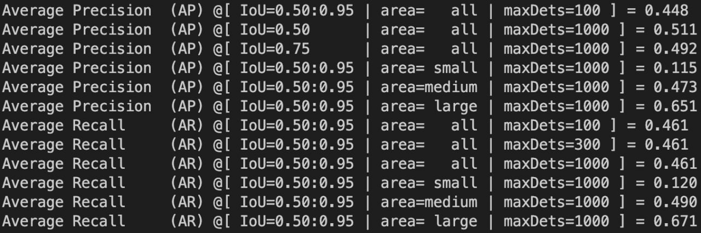
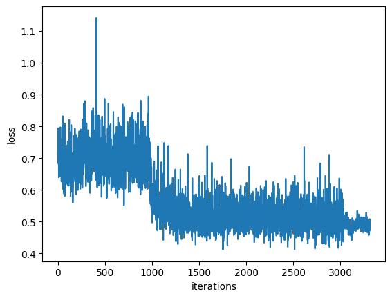
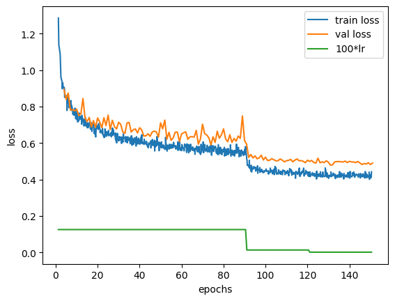
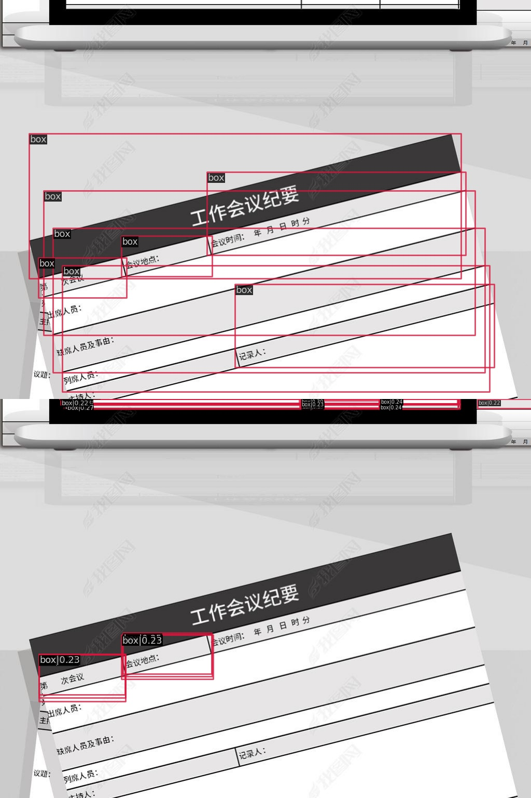
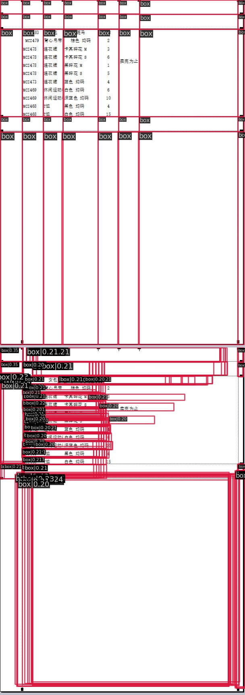
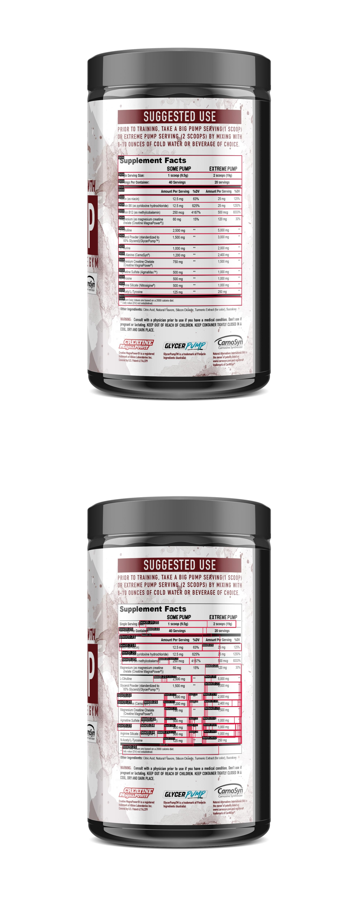
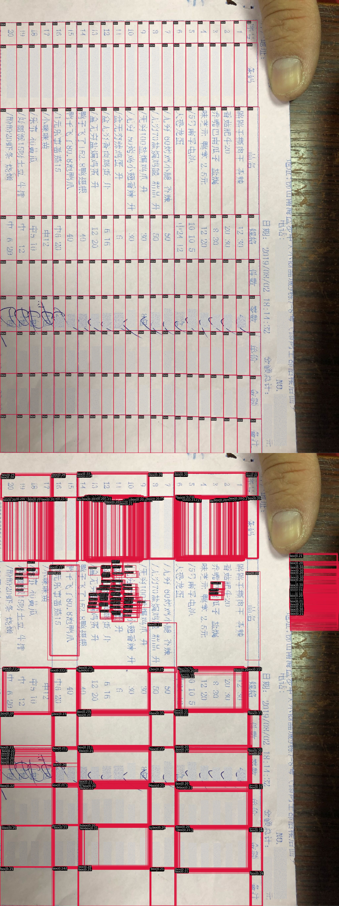

# 1 тренировка

## Тренировка CenterNet на WTW-dataset.

124 эпохи

batch size = 2

backbone = ResNet18

optimizer = SGD lr=0.0025, momentum=0.9, weight_decay=0.0001

lr policy="step", warmup="linear", warmup_iters=1000, warmup_ratio=0.001, step=[10, 20, 30, 40, 50]

Остальное можно посмотреть в конфиге.

Лучшие метрики на тестовой выборке на 98 эпохе.

Лосс с немного обрезанным началом, чтобы было нагляднее.

## Анализ ошибок с трешхолдом 0.3

Просмотрел топ 100 плохих распознаваний

> Сверху оригинал, снизу предсказание

* Таблицы с большим количеством ячеек, например, Excel. Проблема нежирных контуров.

* В датасете есть наклоненные таблицы со странной разметкой

* Перевернутые таблицы, а также таблицы с широкими ячейками

* Неправильная изначальная разметка, проблема с широкими ячейками

* Изогнутые таблицы на упаковках

# 2 тренировка с параметрами статьи

* test_cfg=dict(topk= ~~100~~ 300 или 2000, local_maximum_kernel= ~~3~~ 1, max_per_img= ~~100~~ 300 или 2000)

* lr=0.00125, step on 90, 120

Лосс с немного обрезанным началом, чтобы было нагляднее.

## Анализ ошибок с трешхолдом 0.2

Наклоненные фото с плохой разметкой, множественные пересекающиеся боксы.

Таблица без границ, множественные пересекающиеся боксы.

Проблема с длинными ячейками и едой.

# 5 тренировка resnet34 wandb batch 32

Почему-то не сохранилось лога на train, только на val. 
* test_cfg=dict(topk= ~~100~~ 300 или 2000, local_maximum_kernel= ~~3~~ 1, max_per_img= ~~100~~ 300 или 2000)
* lr=0.00125, step on 90, 120

* resnet34, то есть не будет чекпоинта CenterNet, будет только чекпоинт resnet34 
* wandb 
* batch 32

 Лоссы и метрики https://wandb.ai/centernet/CenterNet/runs/2ae7182x?workspace=user-archiealexarkhipov

## Анализ ошибок с трешхолдом 0.2
Слишком много распознаваний.

Вертикальные и длинные ячейки.

Очень много ложных детекций у еды.

# Average Precision summary

|                | IoU 0.5:0.95, all area, max 100 dets | IoU 0.5, all area, max 1000 dets | IoU 0.75, all area, max 1000 dets | IoU 0.5:0.95, **small** area, max 1000 dets | IoU 0.5:0.95, medium area, max 1000 dets | IoU 0.5:0.95, large area, max 1000 dets |
|----------------|--------------------------------------|----------------------------------|-----------------------------------|---------------------------------------------|------------------------------------------|-----------------------------------------|
| 1 baseline     | **0.448**                            | 0.511                            | 0.492                         | 0.115                                       | 0.473                                    | **0.651**                               |
| 2 paper params, max 300dets | 0.306                                | 0.492                            | 0.485                             | 0.299                                       | 0.635                              | 0.437                                   |
| 2 paper params, max 2000dets | 0.306 | 0.602 | 0.587 | 0.562 | **0.742** | 0.443 |
| 5 ResNet34, max 300dets    | 0.317                                | 0.527                        | 0.517                             | 0.303                                   | 0.617                                    | 0.43                                    |
| 5 ResNet34, max 2000dets | 0.317 | **0.645** | **0.623** | **0.565** | 0.728 | 0.437 |

# Notes
* max 958 gt bboxes in val dataset.