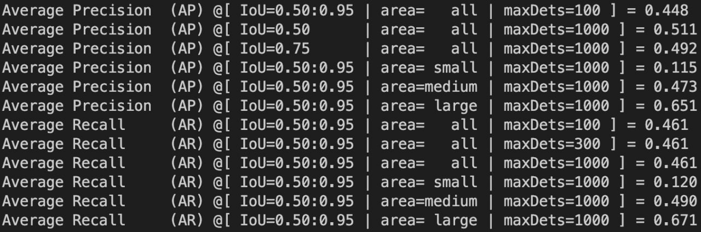
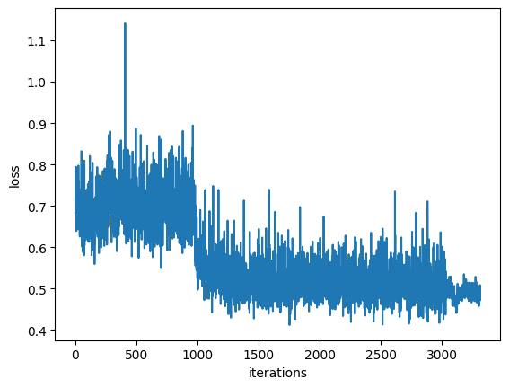
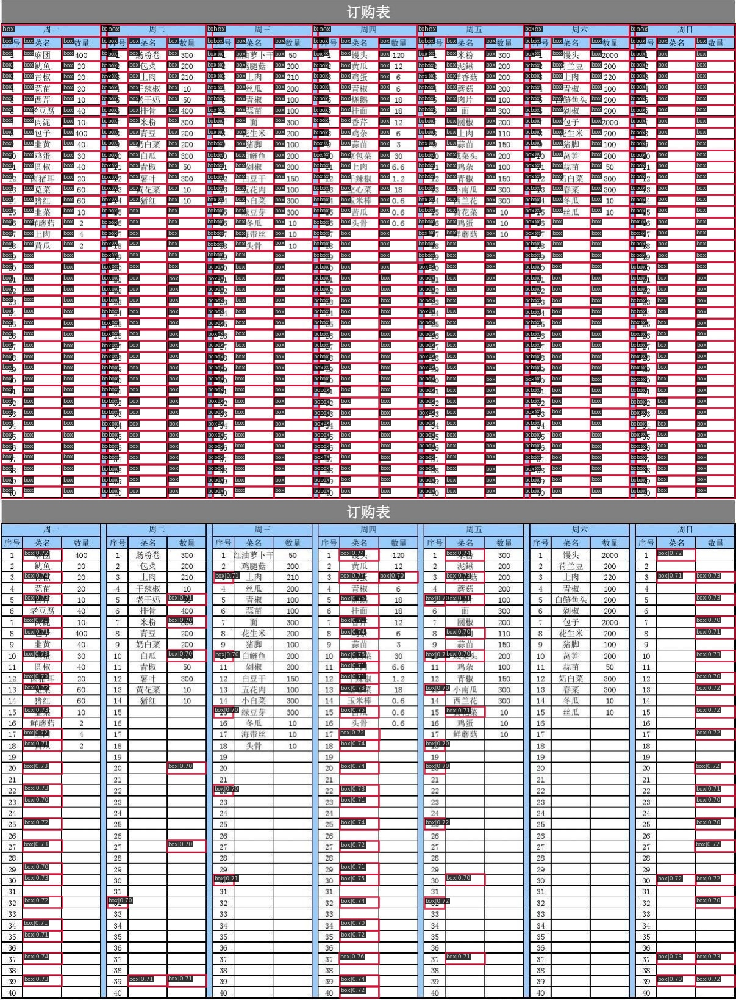
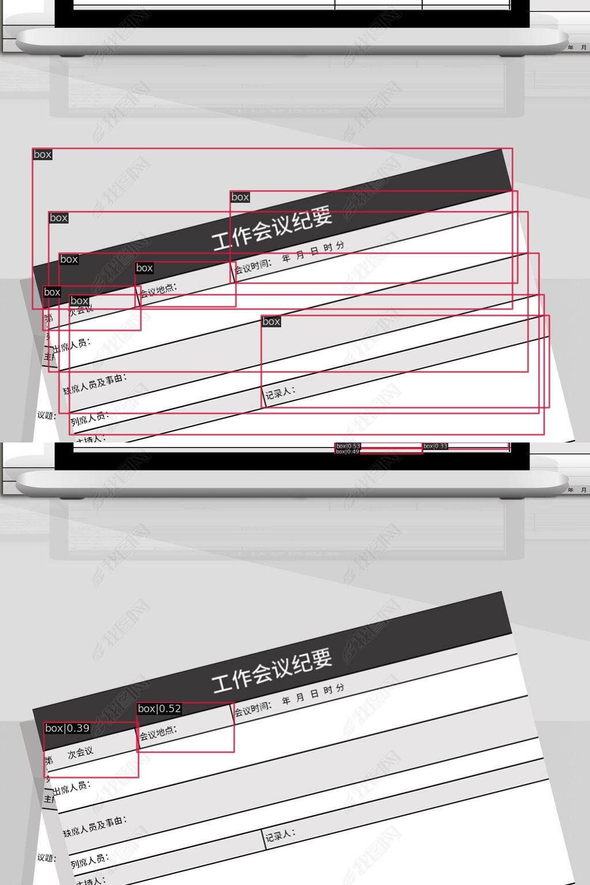
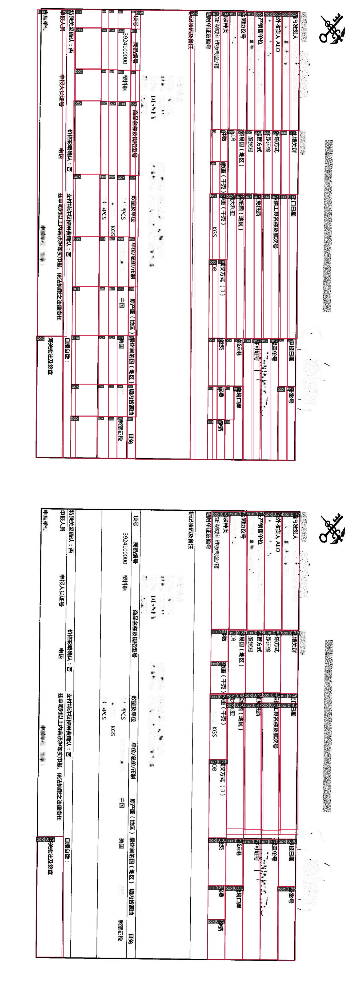

## Тренировка CenterNet на WTW-dataset.

124 эпохи

batch size = 2

backbone = ResNet18

optimizer = SGD lr=0.0025, momentum=0.9, weight_decay=0.0001

lr policy="step", warmup="linear", warmup_iters=1000, warmup_ratio=0.001, step=[10, 20, 30, 40, 50]

Остальное можно посмотреть в конфиге.

Лучшие метрики на тестовой выборке на 98 эпохе.

Лосс с немного обрезанным началом, чтобы было нагляднее.

## Анализ ошибок

Просмотрел топ 100 плохих распознаваний

> Сверху оригинал, снизу предсказание

* Таблицы с большим количеством ячеек, например, Excel. Проблема нежирных контуров.

* В датасете есть наклоненные таблицы со странной разметкой

* Перевернутые таблицы, а также таблицы с широкими ячейками

* Неправильная изначальная разметка, проблема с широкими ячейками

* Изогнутые таблицы на упаковках

